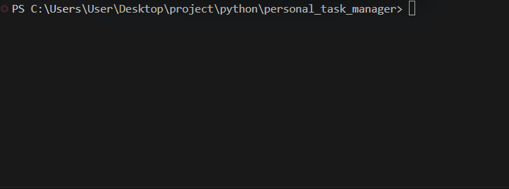

# 📋 Personal Task Manager

A simple and organized command-line task manager built with Python. Manage your tasks, save them locally, and access Admin Mode with environment-based password authentication.

<p align="left">
  
  
  
  
</p>

---

## 📑 Table of Contents

- [✨ Features](#-features)
- [📁 Project Structure](#-project-structure)
- [📄 File Description](#-file-description)
- [🛠️ Requirements](#️-requirements)
- [📦 Installation](#-installation)
- [🔐 Environment Setup](#-environment-setup)
- [▶️ Usage](#️-usage)
- [💻 Example Output](#-example-output)
- [📸 Screenshots](#-screenshots)
- [🎬 Demo](#-demo)
- [🗺️ Roadmap](#️-roadmap)
- [🤝 Contributing](#-contributing)
- [📜 License](#-license)
- [👨‍💻 Author](#-author)

---

## ✨ Features

### ✅ Task Management
- Add tasks through the terminal.
- Prevent empty tasks from being added.
- Display tasks in a numbered list.

### 💾 Task Storage
- Save tasks in `tasks.txt`.
- Load previously saved tasks.
- Keep tasks associated with the user's name.

### 🔐 Admin Mode
- Choose whether to enter Admin Mode.
- Verify the admin password.
- Load the password from `.env`.
- Keep the password outside the main Python file.

---

## 📁 Project Structure

```text
personal_task_manager/
│
├── main.py
├── tasks.py
├── .env.example
├── .gitignore
├── requirements.txt
├── README.md
│
├── Screenshots/
│   ├── pic1.png
│   ├── pic2.png
│   └── pic3.png
│
└── gifs/
    └── demo.gif
```

> **Note:** `.env` and `tasks.txt` are local files ignored by Git. They should not be included in the public repository.

## 📄 File Description

| File | Description |
|---|---|
| `main.py` | Main program and task management logic |
| `tasks.py` | Contains the task display function |
| `.env.example` | Example environment variable configuration |
| `.gitignore` | Specifies files Git should ignore |
| `requirements.txt` | Lists required external Python packages |
| `README.md` | Project documentation |
| `pictures/` | Stores project screenshots |
| `gifs/` | Stores demo GIF files |
| `.env` | Local admin password configuration; not tracked |
| `tasks.txt` | Local task data; not tracked |

---

## 🛠️ Requirements

Make sure you have the following installed:

- 
- 

---

## 📦 Installation

**1. Clone the repository**

```bash
git clone https://github.com/a-h-ourghali/personal_task_manager.git
```

**2. Open the project folder**

```bash
cd personal_task_manager
```

**3. Check your Python version**

```bash
python --version
```

**4. Install the required packages**

```bash
pip install -r requirements.txt
```

---

## 🔐 Environment Setup

The project uses a `.env` file to store the Admin Mode password outside the Python source code.

**1. Create `.env` from `.env.example`.**

Windows PowerShell:

```powershell
Copy-Item .env.example .env
```

Linux / macOS:

```bash
cp .env.example .env
```

**2. Open `.env` and set a test password.**

```dotenv
TASK_MANAGER_ADMIN_PASSWORD=your_password_here
```

**3. Save the file.**

> ⚠️ Never commit `.env` to GitHub. Keep the example file `.env.example` tracked, and keep your actual password private.

---

## ▶️ Usage

**1. Run the program**

```bash
python main.py
```

**2. Follow the prompts**

1. Choose `yes` or `no` for Admin Mode.
2. If you choose `yes`, enter your test admin password.
3. Enter your name.
4. Add tasks one by one.
5. Type `done` when you finish.
6. View your numbered task list.

Run the program again with the same name to load previously saved tasks.

---

## 💻 Example Output

```text
Do you want to enter Admin Mode? (yes/no): no

Name: Alex
Welcome Alex

Enter a task or type done: Finish homework
Task added

Enter a task or type done: Practice Python
Task added

Enter a task or type done: done

Your tasks:
1. Finish homework
2. Practice Python
```

---

## 📸 Screenshots

Add three real screenshots of your program to the `pictures/` folder.

### 🚀 Program Start


### ✍️ Adding Tasks


### 📋 Task List


---

## 🎬 Demo

Watch the program in action:



---

## 🗺️ Roadmap

- [x] Add tasks through the terminal
- [x] Validate empty tasks
- [x] Save tasks to a file
- [x] Load saved tasks
- [x] Display tasks in a numbered list
- [x] Add Admin Mode
- [x] Load the admin password from `.env`
- [ ] Add task priorities (`low`, `medium`, `high`)
- [ ] Add task completion status
- [ ] Add task editing and deletion

---

## 🤝 Contributing

Contributions and suggestions are welcome.

If you find a bug or have an idea for improving the project, feel free to open an issue or submit a pull request.

---

## 📜 License

License information will be added later.

---

## 👨‍💻 Author

**Amirhossein Sourghali**

[](https://github.com/a-h-ourghali)

[Visit my GitHub profile](https://github.com/a-h-ourghali)